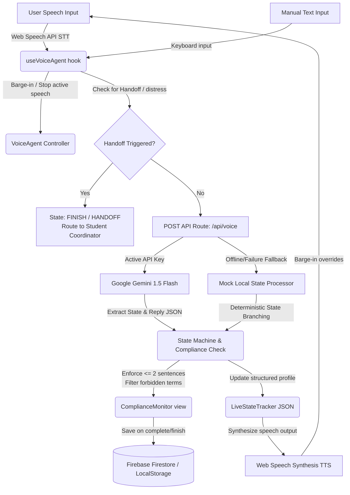

# 🎙️ SkillPivot AI - Market Discovery Voice Agent

Built as part of the **Blue Dots Economy Market Discovery Challenge**, SkillPivot AI is a Next.js 15 and React 19 prototype showcasing a state-of-the-art **Conversational Voice Discovery Portal**. It interacts with visitors, progressively profiles their goals and technology constraints, enforces strict compliance constraints on marketing claims, and registers qualified leads directly into Firebase (falling back to LocalStorage offline).

---

## 🏗️ Architecture Workflow Blueprint

Below is the logical flow of how user voice input, state updates, LLM requests, compliance audits, and database persistence coordinate dynamically:



---

## ⚡ Core Features

1. **🎙️ Native Voice Integration & Barge-in Support**
   - Integrates the browser's native **Web Speech Recognition API** (Speech-to-Text) and **Web Speech Synthesis API** (Text-to-Speech).
   - Features full **barge-in capability**: triggering the microphone instantly cancels active speech synthesis so the user is never stuck listening to long AI monologues.
   
2. **🧠 Dynamic Progressive Profiling State Machine**
   - Rather than overwhelming users with a long contact form, a structured state machine adapts the conversation dynamically through branching paths:
     - **Student Branch**: Captures current enrollment year, target career path, domain interest (Robotics, AI, IoT, etc.), and learning barriers.
     - **College/University Representative Branch**: Captures student enrollment sizes, existing practical lab equipment, budget scope, and pilot trial interest.
     - **Working Professional Branch**: Captures job roles, upskilling goals, stack transitions, and schedule/cost barriers.
     - **Other Branch**: Captures general tech goals.
   - All branches flow into a unified **Lead Capture Phase** (Name, Phone, Email, Organization).
   
3. **🛡️ Real-Time Compliance Audit Engine**
   - Inspects outgoing responses against strict marketing guardrails:
     - Responses must be strictly **$\le$ 2 sentences**.
     - Absolute claims or placement guarantees are blocked via a blacklist audit filter (blocking terms like: *guaranteed*, *100%*, *pakka*, *best opportunity*, *100% placement*).
   - Cleaned output replaces forbidden terms with compliant alternatives before speech synthesis starts.

4. **🔊 Built-in Web Audio API Oscillator Sounds**
   - Programmatic user interface sound effects (Tick on record start, Pop on completion, and a Success Chime upon session capture) created entirely through the **Web Audio API** oscillators—eliminating heavy external audio files.

5. **📊 Interactive Live Telemetry Dashboard**
   - **Live State Tracker**: Renders a real-time syntax-highlighted visual JSON payload representing variables captured in the conversation, flashing cyan on state updates.
   - **Compliance Monitor Panel**: Renders real-time visual indicators showing sentence count status and vocabulary check outcomes.
   - **Profile Presets Selector**: Allows one-click simulation loading to quickly test different persona paths without manual speaking.
   - **Interactive History**: View and load previous sessions from database archives.

6. **🔌 Hybrid Online/Offline Framework**
   - Configures a dual-mode client database and AI layer. If environment keys for Firebase or Gemini are missing, the system gracefully falls back to local storage and a highly accurate client-side mock response engine.

---

## 📂 Project Directory Structure

```text
├── app/
│   ├── api/
│   │   └── voice/
│   │       └── route.ts             # API relay connecting frontend to Gemini LLM
│   ├── dashboard/
│   │   └── page.tsx                 # Main application dashboard workspace
│   ├── login/
│   │   └── page.tsx                 # Guest & user authentication screen
│   ├── globals.css                  # Custom styling (Tailwind CSS v4 & custom animations)
│   ├── layout.tsx                   # Font & metadata wrapper
│   └── page.tsx                     # Landing Page (Hero section & feature matrix)
├── components/
│   ├── VoiceAgent.tsx               # Voice recording visualizer, transcript & text backup input
│   ├── LiveStateTracker.tsx         # Syntax-highlighted live JSON state viewer with update flash
│   ├── ComplianceMonitor.tsx        # Active guidelines validator panel
│   ├── ProfileSelector.tsx          # Fast test preset buttons
│   ├── HistoryList.tsx              # Sessions list loaded from Firestore/LocalStorage
│   └── UserPersonasSection.tsx      # Target demographic illustrations
├── hooks/
│   └── useVoiceAgent.ts             # Primary React hook managing audio, recording states & API calls
└── lib/
    ├── firebase.ts                  # Firebase initializer & local Storage mock wrapper
    ├── gemini.ts                    # Google Generative AI config & offline fallback emulator
    └── stateMachine.ts              # Flow definitions, rules, compliance, and handoff criteria
```

---

## 🚀 Getting Started

### 1. Prerequisites
- **Node.js** (v18.x or above)
- **npm** / **yarn** / **pnpm** / **bun**

### 2. Installation
Clone the repository, navigate to the folder, and install the package dependencies:
```bash
npm install
```

### 3. Environment Variables Config
Create a `.env.local` file in the root directory to connect your API integrations.

```env
# Gemini API Key for dynamic LLM conversation (https://aistudio.google.com)
GEMINI_API_KEY=your_gemini_api_key_here

# Firebase Web App config (optional - falls back to LocalStorage if empty)
NEXT_PUBLIC_FIREBASE_API_KEY=your_firebase_api_key
NEXT_PUBLIC_FIREBASE_AUTH_DOMAIN=your_project.firebaseapp.com
NEXT_PUBLIC_FIREBASE_PROJECT_ID=your_project_id
NEXT_PUBLIC_FIREBASE_STORAGE_BUCKET=your_project.appspot.com
NEXT_PUBLIC_FIREBASE_MESSAGING_SENDER_ID=your_sender_id
NEXT_PUBLIC_FIREBASE_APP_ID=your_app_id
```

> [!NOTE]
> If **`GEMINI_API_KEY`** or **Firebase variables** are not supplied, the app enters **Mock Offline Mode**. All voice functions, progressive branches, state trackers, and session history remain fully operational via client-side emulators and LocalStorage.

### 4. Running the Development Server
Launch the development server with Turbopack for super-fast hot module reloading:
```bash
npm run dev
```
Open [http://localhost:3000](http://localhost:3000) in your browser to view the application.

### 5. Building for Production
Ensure all ESLint rules and TypeScript types build cleanly:
```bash
npm run build
```

---

## 🛠️ Technology Stack

- **Framework**: [Next.js 15](https://nextjs.org/) (App Router)
- **Runtime**: [React 19](https://react.dev/) & [TypeScript](https://www.typescriptlang.org/)
- **Styling**: [Tailwind CSS v4](https://tailwindcss.com/)
- **Icons**: [Lucide React](https://lucide.dev/)
- **AI Core**: [@google/generative-ai SDK](https://www.npmjs.com/package/@google/generative-ai) (Gemini 1.5 Flash)
- **Database / Auth**: [Firebase v12](https://firebase.google.com/) (Auth & Firestore)
- **Voice APIs**: Native Web Speech Recognition & Speech Synthesis
- **Audio Effects**: Native Web Audio API (OscillatorNode)
